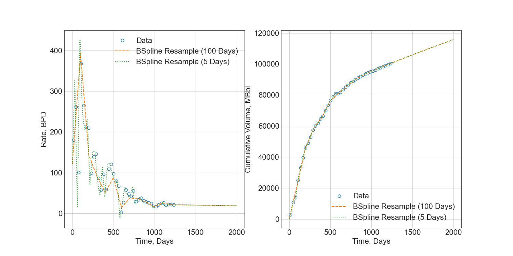

# Material Balance Resampling

#### David S. Fulford

Simple example of use of b-splines to maintain mass balance while resampling production rates.

The order of a b-spline is analogous to the order of a polynomial. For example, a b-spline of
order 1 is a piecewise linear function. A b-spline of order 2 is a piecewise quadratic function.
A b-spline of order 3 is a piecewise cubic function. And so on.

B-splines are defined by their control points, but are continuous and differentiable. The derivative
of a b-spline of order `k` has order `k-1`. Using this property, we can use the order of the b-spline
to control the behavior of the resampling. We fit a b-spline to the cumulative production, and then
resample the derivative of the b-spline to get the production rates. Where we place the control points
determines the behavior of the resampling.

`resample.py` uses a quadratic b-spline to fit cumulative production, and the resampling generates
piecewise linear production rates. `resample_avg.py` uses a linear b-spline to fit cumulative
production, and the resampling generates piecewise constant production rates (average rates).

#### Piecewise Linear Resampling

#### Average Rate Resampling

